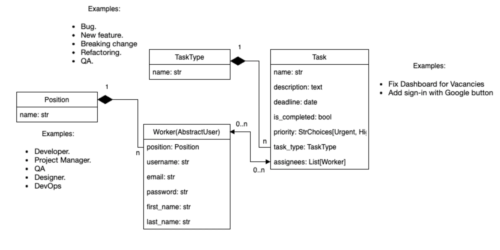
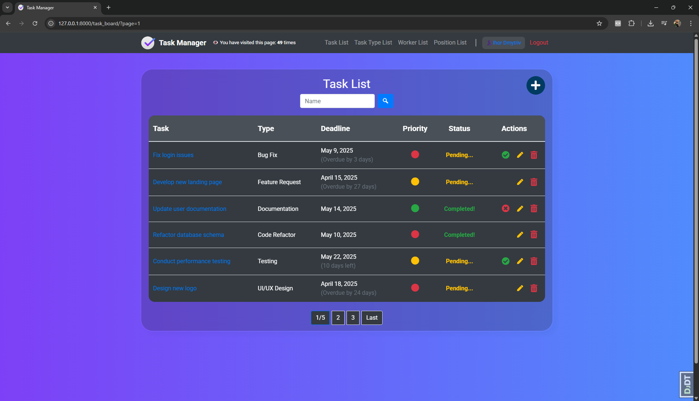
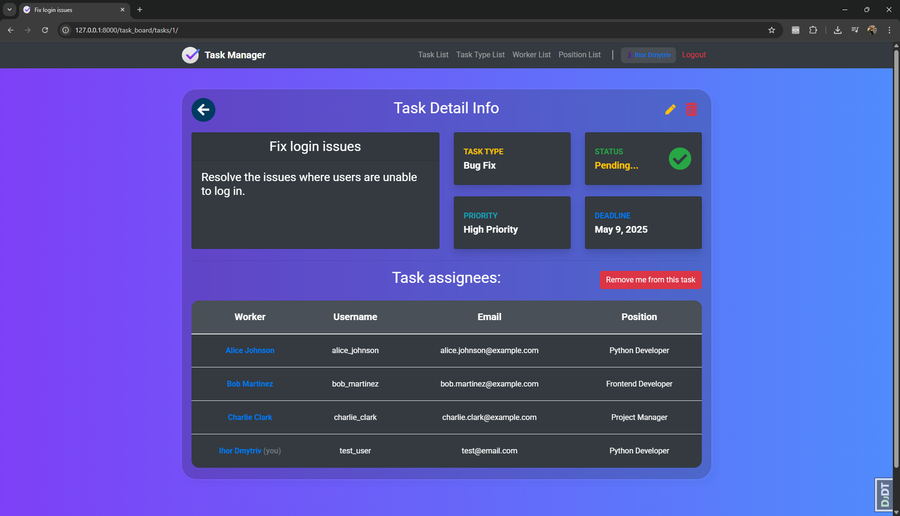
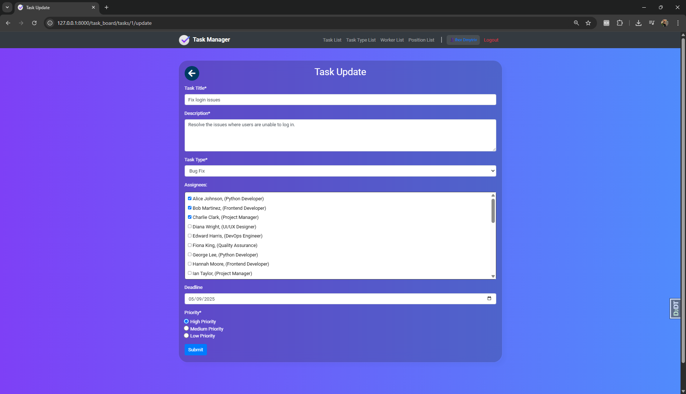
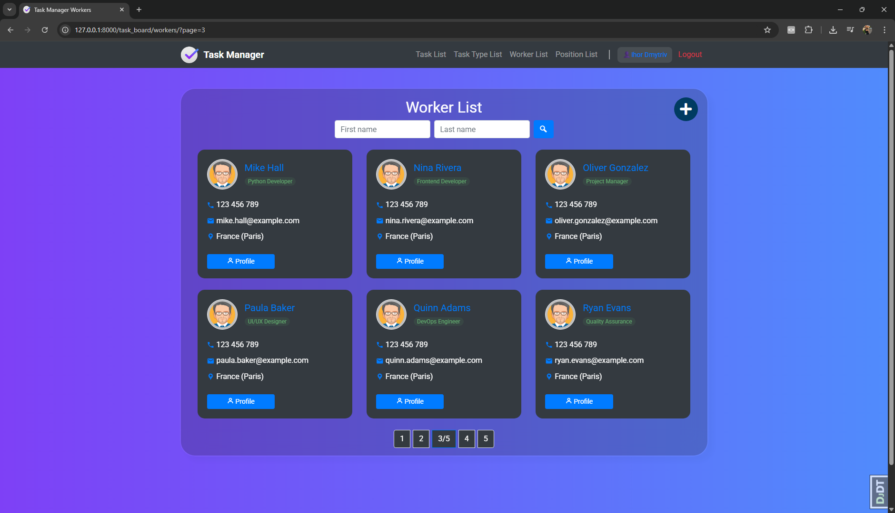

# 🧠 IT Company Task Manager

> **Manage tasks and team collaboration efficiently inside your IT company.**

A Django-based web application for managing tasks and team members in an IT company. This project was developed as part of a learning course to practice building real-world applications using Django.

---


## 🔗 Live Demo

👉 [Try the app on Render](https://ihor-dmytriv-task-manager.onrender.com)


---


## 🛠 Technologies Used

* Python 3.12
* Django 5.x
* SQLite (can be replaced with PostgreSQL)
* HTML, CSS, Bootstrap 5
* Django Crispy Forms
* Git, GitHub

---

## 🚀 Features

* 🔐 User authentication (login, logout, register)
* 🧑‍💻 Assign users to tasks
* ✅ Toggle task completion status
* 🗓️ Set deadlines and priorities
* ↕️ Sort and filter tasks
* 📅 Task detail, edit and delete views
* 👤 Highlight current user in task assignees ("you" badge)
* ⚠️ Display warning messages for restricted actions

---

## ⚙️ Setup Instructions

1. **Clone the repository**

```bash
git clone https://github.com/IhorDmytriv/task-manager.git
cd task-manager
```

2. **Create a virtual environment**

```bash
python -m venv .venv
source .venv/bin/activate  # On Windows: .venv\Scripts\activate
```

3. **Install dependencies**

```bash
pip install -r requirements.txt
```

4. **Create a `.env` file and add your secret key**

```bash
echo "DJANGO_SECRET_KEY=your_secret_key_here" > .env
```

5. **Apply migrations and run the development server**

```bash
python manage.py migrate
python manage.py runserver
```

---

## 📊 Screenshots
* Models Diagram

* Task list page

* Task detail page

* Task create/update page

* Worker list page


---

## ⚠️ Running Tests

```bash
python manage.py test
```

---

## 👨‍💼 Author

* Ihor Dmytriv
* Built during a Django course to practice backend web development

---

Feel free to contribute or fork the project!
